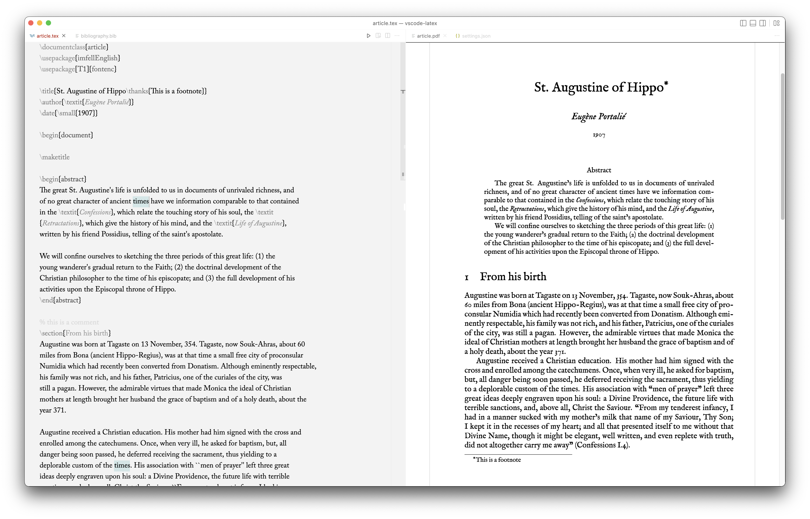

# Settings for VS Code as a (minimal) $\LaTeX$ Editor

My take on a minimal, writing focused VS Code set up for generating $\LaTeX$ documents. 
I wanted to avoided all the usual clutter that comes with VS Code and tones down the syntax highlighting. 

## Requirements
- [LaTeX Workshop](https://marketplace.visualstudio.com/items?itemName=James-Yu.latex-workshop)
- [Adobe Caslon Pro](https://fonts.adobe.com/fonts/adobe-caslon): for the editor
  - Free alternative: [Cormorant Garamond](https://fonts.google.com/specimen/Cormorant+Garamond)
- [Monochrome VS Code theme](https://marketplace.visualstudio.com/items?itemName=anotherglitchinthematrix.monochrome)
- [M Fell English](https://ctan.org/pkg/imfellenglish?lang=en): $\LaTeX$ font, should auto install upon first run
